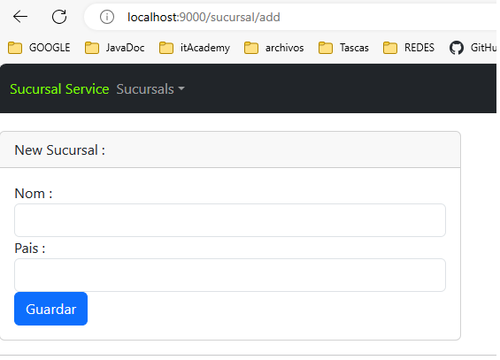
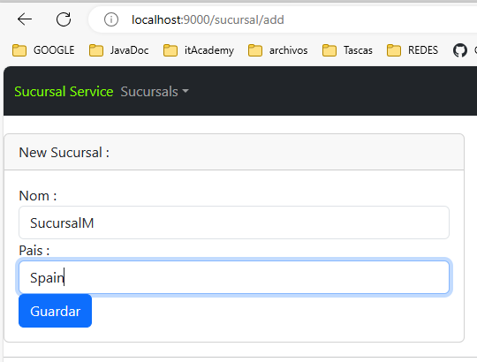
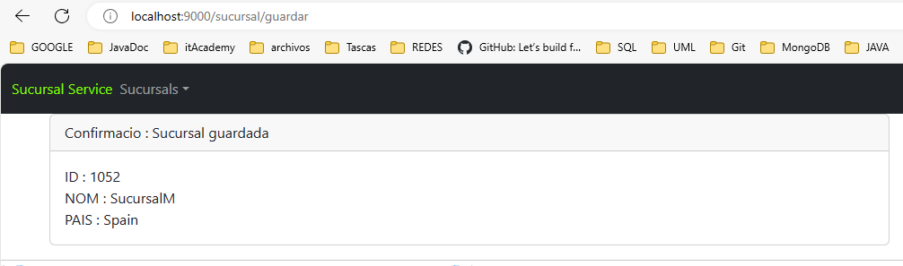

# Sucursal Service (S05T01N01AbdellaouiFethi)
- CRUD (Create, Read, Update, Delete).
- API Rest.
- Web Application with Thymeleaf & Bootstrap 5

- http://localhost: 9000/sucursal/add

- http://localhost: 9000/sucursal/edit...

- http://localhost: 9000/sucursal/delete/{id}

- http://localhost: 9000/sucursal/getAll

