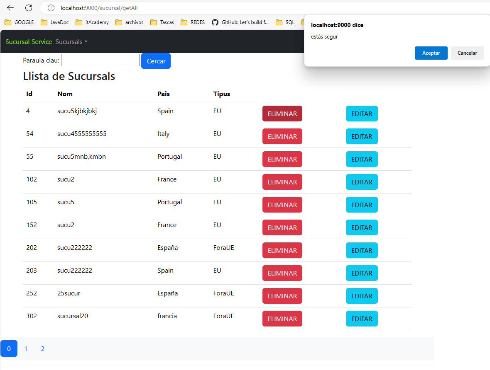

# Sucursal Service (S05T01N01AbdellaouiFethi)

- CRUD (Create, Read, Update, Delete).

- Web Application with Thymeleaf & Bootstrap 5

-------- 

- localhost: 9000/sucursal/add (formSecursal.html)

-localhost: 9000/sucursal/update (edit...)

- localhost: 9000/sucursal/delete/{id}

- http://localhost: 9000/sucursal/getAll
  paging : --> using interface Page<T>  & interface Pageable

- Thymeleaf:
  - name space : xmlns:th="http://www.thymeleaf.org"
  - & xmlns:layout="http://www.ultraq.net.nz/thymeleaf/layout"

- Bootstrap 5:
  - css : bootstrap.min.css
  - js : bootstrap.bundle.min.js
